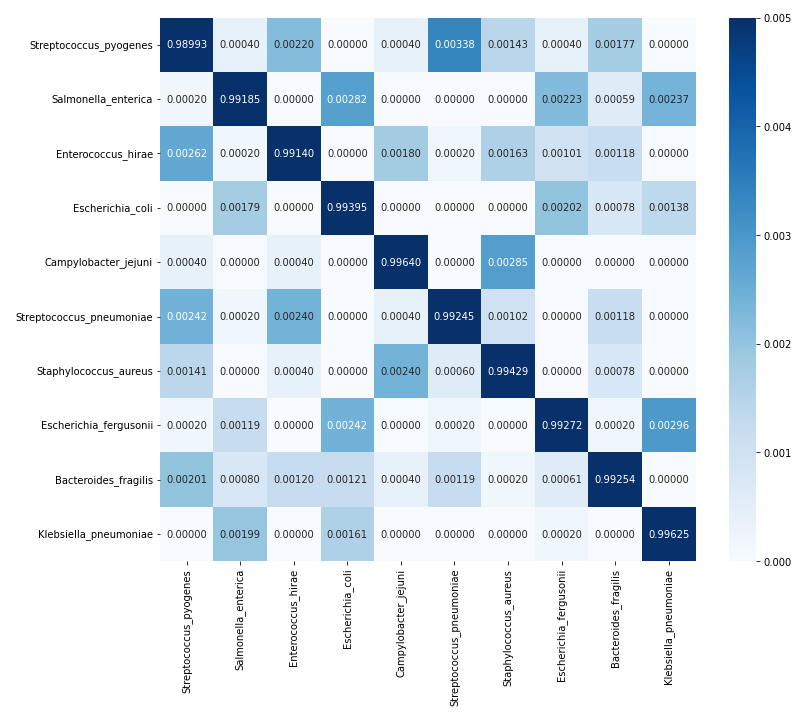

# Data Science Portfolio - Dulitha Jayakodige

This is a collection of Data Analysis and Machine Learning projects I have done for academic and self-learning purposes. If you have any questions about these projects, like to have a chat or collaborate with me, please feel free to contact me via
* Email: dulitha.mj@gmail.com
* CV: [https://github.com/dulithaJayakodige/dulithajayakodige.github.io/blob/main/mostUpdatedCV.pdf](https://github.com/dulithaJayakodige/dulithajayakodige.github.io/blob/main/mostUpdatedCV.pdf)
* Linkedin: [https://www.linkedin.com/in/dulithajayakodige/](https://www.linkedin.com/in/dulithajayakodige/)
* Kaggle: [https://www.kaggle.com/dulithajayakodige](https://www.kaggle.com/dulithajayakodige)
* Github: [https://github.com/dulithaJayakodige](https://github.com/dulithaJayakodige)

## Projects

### 1. Predicting Bacteria Types 

RandomForestClassifier from sklearn was used to indentify the bacteria type based on their contributions of each ATGC composition. While working on this project I learned to use pandas, numpy, matplotlib, seaborn, RandomForestClassifier, train_test_split, confusion_matrix, and accuracy_score from sklearn. My model could predit the type of a bacteria upto 99% accuracy. You can find more information on my notebook [https://www.kaggle.com/code/dulithajayakodige/simple-ml-model-to-predict-bacteria-type/notebook](https://www.kaggle.com/code/dulithajayakodige/simple-ml-model-to-predict-bacteria-type/notebook)

