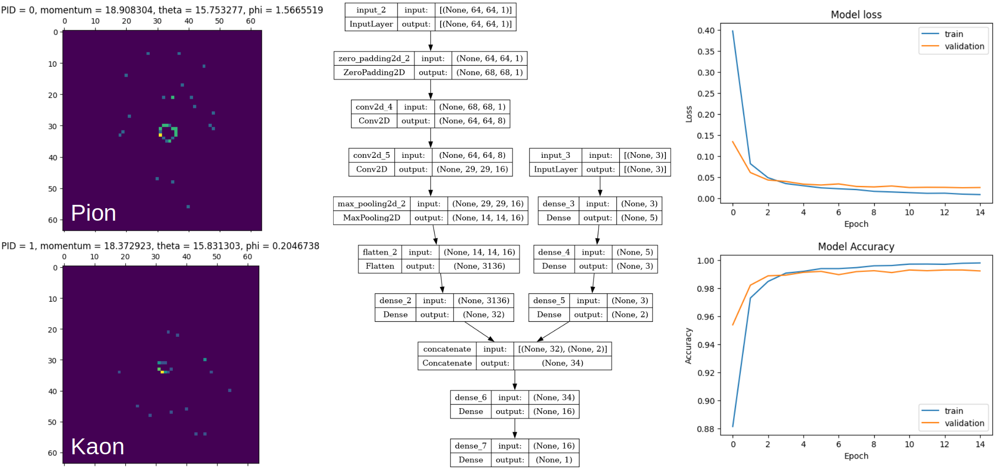

This is a collection of Data Analysis and Machine Learning projects I have done for academic and self-learning purposes. If you have any questions about these projects, like to have a chat or collaborate with me, please feel free to contact me via
* Email: dulitha.mj@gmail.com
* Linkedin: [https://www.linkedin.com/in/dulithajayakodige/](https://www.linkedin.com/in/dulithajayakodige/)
* Kaggle: [https://www.kaggle.com/dulithajayakodige](https://www.kaggle.com/dulithajayakodige)
* Github: [https://github.com/dulithaJayakodige](https://github.com/dulithaJayakodige)
* CV: [https://github.com/dulithaJayakodige/dulithajayakodige.github.io/blob/main/CV.pdf](https://github.com/dulithaJayakodige/dulithajayakodige.github.io/blob/main/CV.pdf)

## Projects
### 1. Classifying Pions and Kaons

Pion and Kaon are subatomic particles that are made out of a quark and an antiquark. They are created during high-energy collision experiments, and scientists have developed detectors to track them. I took part in the AI4EIC Hackathon, where we had to build a model to classify Pions and Kaons from a large set of data. Our team won second place with a basic Convolutional Neural Network (CNN). Later, I built a model with multiple inputs using the Keras Functional API. In this model, kinematics variables (momentum and angles) were inputted into a Neural Network (NN), while particle detection data was transformed into 64x64 images and inputted into a CNN. The outputs of the NN and CNN were then fed into another NN to obtain the output. This model could classify Pions and Kaons with above 98% accuracy. Please check the following link for further details on this project.
[https://github.com/dulithaJayakodige/PionKaon/tree/main](https://github.com/dulithaJayakodige/PionKaon/tree/main)

### 2. Predicting Bacteria Types 

RandomForestClassifier from sklearn was used to identify the bacteria type based on their contributions to each ATGC composition. While working on this project I learned to use pandas, NumPy, matplotlib, seaborn, RandomForestClassifier, train_test_split, confusion_matrix, and accuracy_score from sklearn. My model could predict the type of bacteria with up to 99% accuracy. You can find more information on my notebook [https://www.kaggle.com/code/dulithajayakodige/simple-ml-model-to-predict-bacteria-type/notebook](https://www.kaggle.com/code/dulithajayakodige/simple-ml-model-to-predict-bacteria-type/notebook)

### 3. HUBC TERMINAL Hackathon

HUBC TERMINAL was an AI game where we could compete by programming algorithms and battling them against each other. I paired up with my friend, Chukwuemeka Ojih to participate in this competition. We used a given python template to build our algorithm to fight against opponents. Our algorithm was capable of figuring out the opponent's attacking and defending strategies and acting accordingly. At the final competition, our algorithm received 10th place (from 21 submitted algorithms). We practiced not only python programming, but also virtual team working, and working to a deadline. It was really fun! Our algorithm (x5-algo and x7-algo) can be found at [https://github.com/dulithaJayakodige/HUBCTerminal](https://github.com/dulithaJayakodige/HUBCTerminal)

### 4. IBM Data Science Capstone Project

I followed IBM Data Science Professional Certificate through Coursera. As its capstone project, I predicted the success of a future SpaceX Falcon 9 rocket landing process. I used SpaceX API and Web Scraping to collect data for this project. Then I   performed an exploratory data analysis using pandas library and SQL. Then I visualize data using matplotlib and seaborn. Folium was used to make interactive  maps and Plotly Dash was used to build interactive visuals. I used Logistic Regression, K Nearest Neighbor, Decision Tree Classifier, and Support Vector Machine to predict the success of a future landing process. StandardScaler(), train_test_split(), and  GridSearchCV() functions from sklearn were also used for hyperparameter optimization and accuracy calculation. You can see my work at [https://github.com/dulithaJayakodige/Applied_Data_Science_Capstone](https://github.com/dulithaJayakodige/Applied_Data_Science_Capstone)

#### Thank you for visiting. You will see my new projects soon. 
